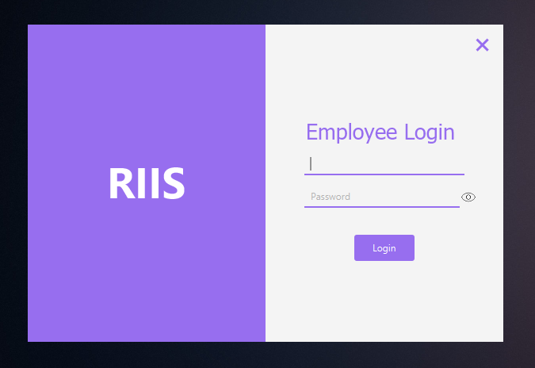
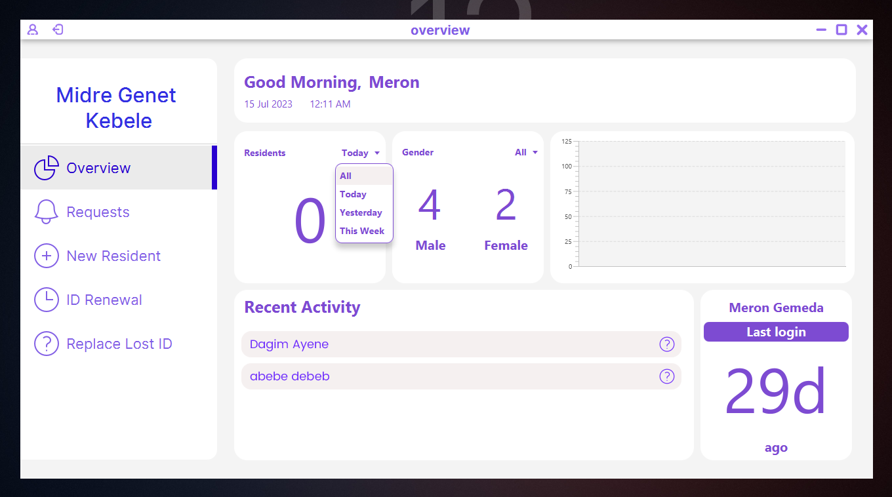
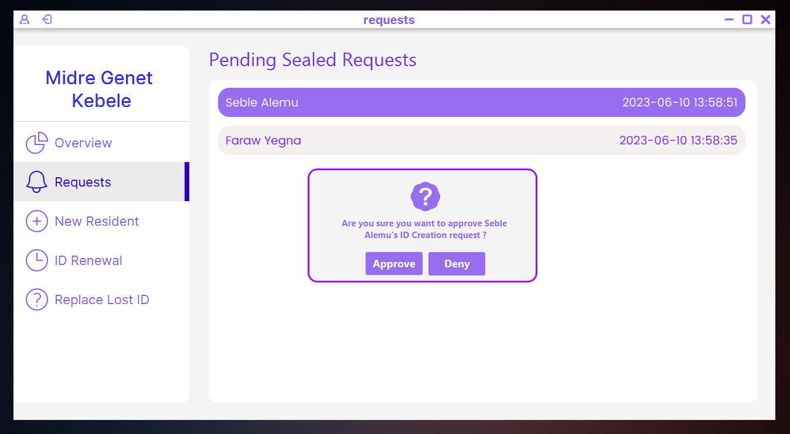
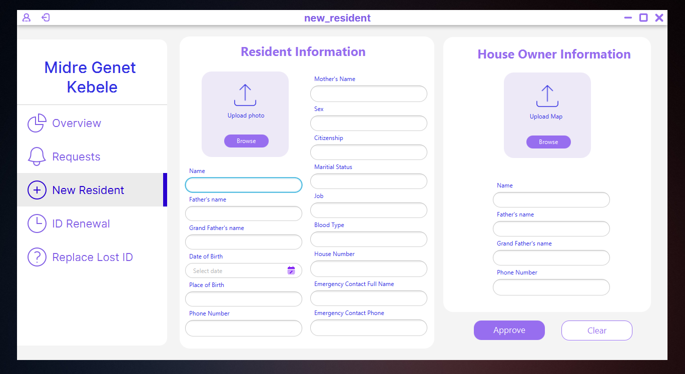
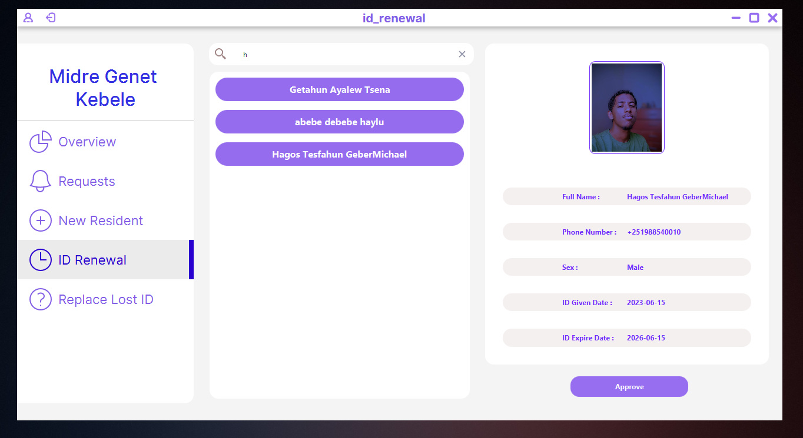
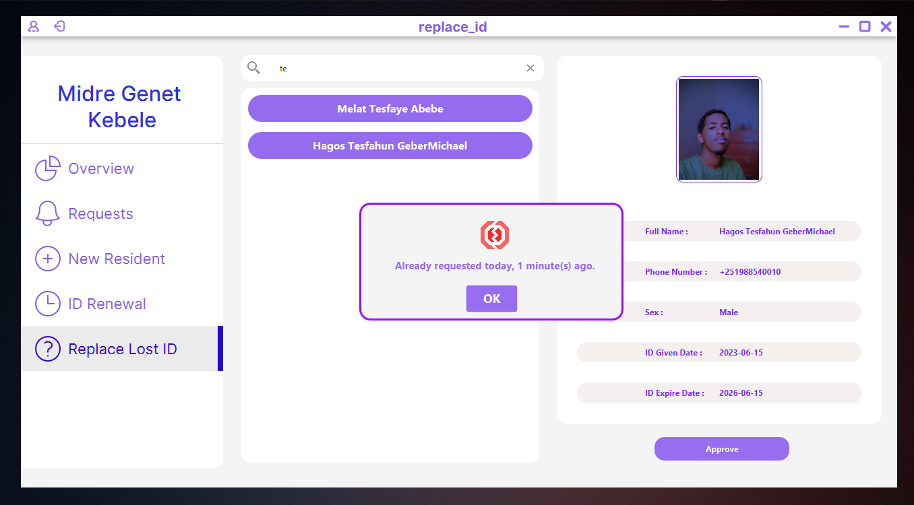
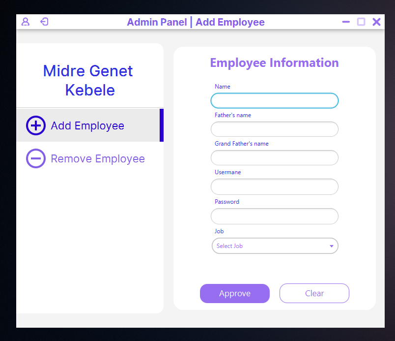
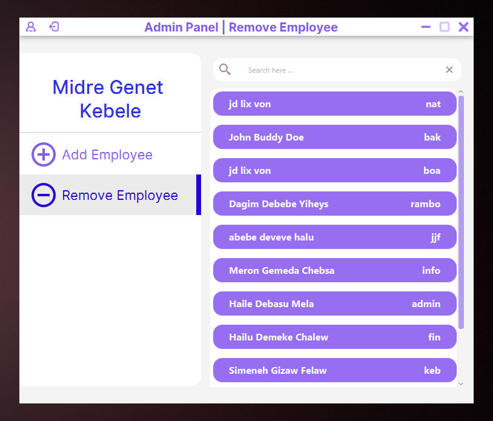
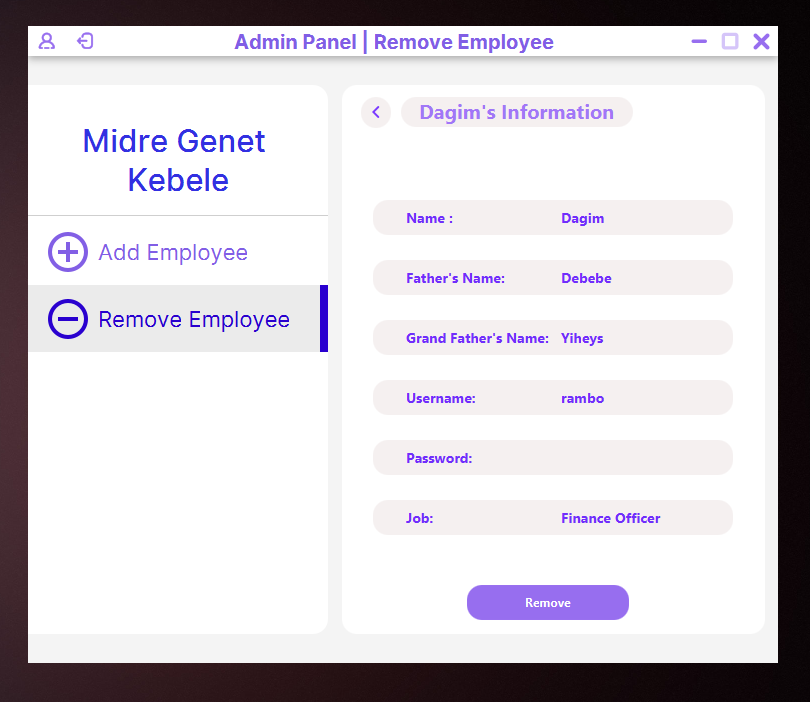

# Getting Started



## Project Name: Resident ID Issuing System

## Project Description

This project is a simple Resident ID Issuing System. It is a desktop application that can be used to issue resident IDs to the residents of a particular kebele. We worked on
this project because of the problems that we have seen in our kebele. The problems are:

1. Not getting the ID on time
2. Not getting the ID at all
3. Not getting the ID with the correct information
4. The kebele not having a difitalized database of the residents

So, we decided to solve these problems by creating this application. This application will help the kebele to issue IDs to the residents on time, with the correct information and also it will help the kebele to have a digitalized database of the residents.

## Project Features

1. The application will have a login page where the kebele employee can login to the application.
2. The application will have an overview page to show the number of residents in the kebele, gender distribution and with graphs.
3. The application will have a page to add a new resident to the database.
4. The application will have a page to edit the information of a resident.
5. The application will streamline the process of issuing IDs to the residents by coming up with a concept of request and approval.
   - The resident will request for an ID through the information officer.
   - The information officer will send the request to the finance officer, so that the resident can pay the required amount of money.
   - The finance officer will send the request to the kebele manager for approval and signature.
   - The kebele manager will approve the request and sign it and finally send it back to the information officer.
   - The information officer will issue the ID to the resident by sealing the ID.

## Project Contributors

1. [Dagim G. Astatkie](https://github.com/dagimg-dot)
2. [Ermias S. Deresse](https://github.com/Jeremi-code)
3. [Smachew Gedefaw C.](https://github.com/sgc93)
4. [Nathnael T. Bekaffa](https://github.com/NathnaelTB)
5. [Melat Tesfaye](https://github.com/Melat369)

## Application Screenshots

### Login Page


### Overview Page



### Requests Page



### Add Resident Page



### ID Renewal Page



### Replace Lost ID Page



### Admin-Add Employee Page



### Admin-Employee List Page



### Admin-Emplyee Detail Page



# To run the project locally

1. Clone the project to your local machine.
2. Open the project in your favorite Java IDE. (We used Visual Studio Code)
3. Apply migrations to the database by running the following maven command in the terminal.

   ```bash
   mvn flyway:migrate
   ```

4. Run the project by running the following maven command in the terminal.

   ```bash
   mvn clean javafx:run
   ```

# To build the project

1. Build the project by running the following maven command in the terminal.

   ```bash
   mvn clean package
   ```

# To contribute to the project

1. Read the [CONTRIBUTING.md](CONTRIBUTING.md) file for the contribution guidelines.

---

<div align="center">Enjoy your coding!! 😊</div>
